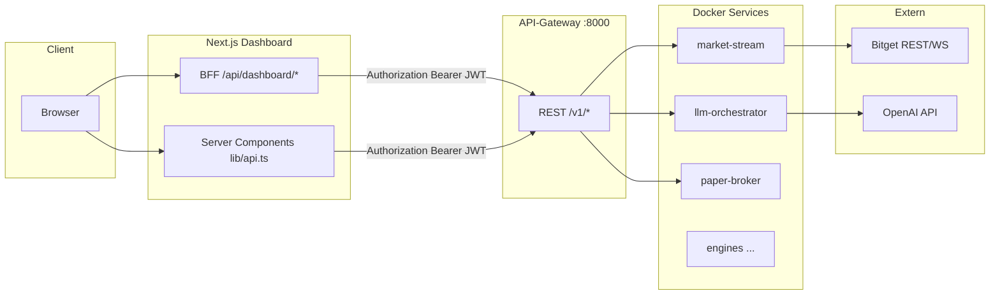

# API- und Integrations-Status (Monorepo)

**Zweck:** Inventar der Aufrufketen, ENV/Secrets, typische Fehlerursachen und **nachvollziehbare** Prüfwege.  
**Ehrlichkeit:** „Schlüssel gesetzt“ reicht nicht — Kontext (Docker vs. Host, welcher Prozess liest welche ENV) entscheidet.

---

## 1. Häufigste echte Ursachen (warum „nichts geht“)

| Rang | Ursache                                                              | Symptom                                               | Fix                                                                                                                                                                                                                                                                                                                                |
| ---- | -------------------------------------------------------------------- | ----------------------------------------------------- | ---------------------------------------------------------------------------------------------------------------------------------------------------------------------------------------------------------------------------------------------------------------------------------------------------------------------------------- |
| 1    | **`HEALTH_URL_*` zeigen im laufenden Gateway auf `localhost`**       | `/ready` zeigt Worker „down“, leere Daten             | **Compose:** `docker-compose.yml` setzt am Service `api-gateway` meist explizit `http://<service>:<port>/ready` — dann ist `localhost` in `.env.local` nur für Host-Tools. **Ohne** solche Overrides (eigener Start) müssen `HEALTH_URL_*` **Docker-Dienstnamen** verwenden. Prüfen: effektive Container-ENV, nicht nur die Datei. |
| 2    | **`DASHBOARD_GATEWAY_AUTHORIZATION` fehlt / falsch / alter Prozess** | BFF 503, Health leer, `operatorHealthProbe.ok: false` | `python scripts/mint_dashboard_gateway_jwt.py --env-file .env.local --update-env-file`; **Next** bzw. Dashboard-Container **neu starten**. `GATEWAY_JWT_SECRET` muss **identisch** zum Mint sein.                                                                                                                                  |
| 3    | **`API_GATEWAY_URL` im Dashboard ≠ erreichbare Adresse**             | 502 „Gateway nicht erreichbar“                        | Container: `http://api-gateway:8000` (Compose setzt das). Host-`pnpm dev`: `http://127.0.0.1:8000`.                                                                                                                                                                                                                                |
| 4    | **`INTERNAL_API_KEY` mismatch**                                      | Gateway → LLM-Orchestrator / interne Worker 401/403   | Ein Wert in **allen** Diensten, die sich ansprechen; Header `X-Internal-Service-Key` (siehe `shared_py.service_auth`).                                                                                                                                                                                                             |
| 5    | **`INTERNAL_API_KEY` vs. `GATEWAY_INTERNAL_API_KEY` verwechselt**    | Admin/Mutations-Pfade vs. Service-Forward             | **`INTERNAL_API_KEY`**: Dienst-zu-Dienst (Orchestrator, Worker). **`GATEWAY_INTERNAL_API_KEY`**: Gateway-interner Admin-Key (`X-Gateway-Internal-Key`). Siehe `docs/api_gateway_security.md`.                                                                                                                                      |
| 6    | **CORS / direkter Browser → Gateway**                                | Browser blockiert ohne passende `CORS_ALLOW_ORIGINS`  | `NEXT_PUBLIC_ADMIN_USE_SERVER_PROXY=true` + serverseitiger Proxy (Standard im Compose-Dashboard) oder CORS am Gateway für deine Origin.                                                                                                                                                                                            |
| 7    | **Bitget Demo vs. Live**                                             | 401/invalid sign                                      | `BITGET_DEMO_ENABLED=true` + **`BITGET_DEMO_*`** Credentials; sonst Live-Keys unter `BITGET_*`.                                                                                                                                                                                                                                    |
| 8    | **OpenAI fehlt, Fake aus**                                           | LLM 502/503                                           | Lokal: `LLM_USE_FAKE_PROVIDER=true` **oder** `OPENAI_API_KEY` am **llm-orchestrator** setzen (nicht im Browser).                                                                                                                                                                                                                   |

---

## 2. Architektur der Aufrufketen

---

## 3. Inventar-Tabelle (Kurz)

| Integration                  | Client / Pfad                                | Auth                                    | Basis-URL / Quelle ENV                                     | Timeout (typ.)           | Retries          | Health / Smoke                      | Fake / Fallback                                                |
| ---------------------------- | -------------------------------------------- | --------------------------------------- | ---------------------------------------------------------- | ------------------------ | ---------------- | ----------------------------------- | -------------------------------------------------------------- |
| **PostgreSQL**               | Alle Python-Services, Gateway                | Connection string                       | `DATABASE_URL` / `DATABASE_URL_DOCKER`                     | DB driver                | meist nein       | Gateway `/ready` → postgres check   | —                                                              |
| **Redis**                    | Services, Gateway                            | URL                                     | `REDIS_URL` / `REDIS_URL_DOCKER`                           | —                        | Streams/consumer | `/ready`                            | —                                                              |
| **API-Gateway (öffentlich)** | Browser optional, Smoke                      | CORS / none für `/health`               | `APP_BASE_URL`, Host :8000                                 | 4–12s                    | —                | `GET /health`, `GET /ready`         | —                                                              |
| **API-Gateway (sensibel)**   | Dashboard BFF, `lib/api.ts` server           | **JWT** `Authorization: Bearer`         | `DASHBOARD_GATEWAY_AUTHORIZATION` + `GATEWAY_JWT_SECRET`   | 60s SSR fetch            | —                | `GET /v1/system/health`             | `API_AUTH_MODE=none` (nur dev)                                 |
| **Worker readiness**         | Gateway `/ready`                             | —                                       | **`HEALTH_URL_*`** (Docker-Namen!)                         | `readiness_peer_timeout` | —                | embedded in `/ready`                | —                                                              |
| **LLM Orchestrator**         | Gateway Forward `post_llm_orchestrator_json` | **`INTERNAL_API_KEY`** Header           | `LLM_ORCH_BASE_URL` oder aus `HEALTH_URL_LLM_ORCHESTRATOR` | 120s                     | —                | Worker `/ready`, Operator explain   | **`LLM_USE_FAKE_PROVIDER=true`**                               |
| **OpenAI**                   | llm-orchestrator                             | `OPENAI_API_KEY` (server)               | api.openai.com                                             | provider default         | SDK              | Orchestrator `/ready` Felder        | Fake provider                                                  |
| **Bitget REST/WS**           | market-stream, live-broker, …                | API Key/Secret/Passphrase oder Demo-Set | `BITGET_API_BASE_URL`, `BITGET_WS_*`, Demo-Varianten       | service-spezifisch       | teils ja         | market-stream `/ready`, Public REST | Demo-Account; öffentliche Marktdaten ohne Keys (eingeschränkt) |
| **Dashboard BFF**            | Next Route Handlers                          | `requireOperatorGatewayAuth()`          | `API_GATEWAY_URL` + JWT                                    | 8–60s                    | —                | `GET /api/dashboard/edge-status`    | 503 JSON mit `detail` wenn JWT fehlt                           |
| **Commerce / Stripe**        | Gateway `/v1/commerce/*`                     | Session + Gateway-Auth                  | `COMMERCIAL_*`, `PAYMENT_*`                                | —                        | —                | Usage-Seite, BFF proxy              | `PAYMENT_MOCK_ENABLED`, Mock-Checkout                          |
| **Telegram**                 | alert-engine, Customer-Integration           | Bot token, dry-run                      | `TELEGRAM_*`                                               | —                        | Outbox           | Integrations-API, Approvals-Spalte  | `TELEGRAM_DRY_RUN` (falls vorhanden)                           |
| **News**                     | news-engine                                  | API keys / **NEWS_FIXTURE_MODE**        | `NEWS_*`                                                   | —                        | —                | Engine `/ready`                     | `NEWS_FIXTURE_MODE=true`                                       |
| **Paper Broker**             | paper-broker                                 | intern                                  | Redis/DB                                                   | —                        | —                | `/ready`                            | `PAPER_CONTRACT_CONFIG_MODE=fixture`                           |

---

## 4. Fehlerformat (konsequent)

- **Gateway:** FastAPI `HTTPException` → JSON `detail` (string oder Objekt mit `code`/`message`).
- **Dashboard BFF:** `NextResponse.json({ detail: "..." }, { status: 502|503 })` — siehe `gateway-bff.ts`, `gateway-upstream.ts`.
- **Dashboard server `lib/api.ts`:** wirft `Error` mit Text `GET /v1/...: HTTP nnn — …`; Server loggt `[dashboard-api]` (kein stilles Verschwinden).

---

## 5. Nachweis / Smoke (was „funktioniert“ bedeutet)

| Prüfung                           | Befehl / URL                              | Erwartung                                                                                                   |
| --------------------------------- | ----------------------------------------- | ----------------------------------------------------------------------------------------------------------- |
| **Vollständig (Release-ähnlich)** | `pnpm smoke` / `scripts/rc_health.ps1`    | Gateway `/ready`, Dashboard `/api/health`, `/v1/system/health` mit JWT, Lesepfade                           |
| **Integration fokussiert**        | `python scripts/api_integration_smoke.py` | `/health`, `/ready`, optional JWT health, Warnung bei `localhost` in `HEALTH_URL_*`, optional Bitget public |
| **Edge-Diagnose (UI)**            | Browser: `/api/dashboard/edge-status`     | `gatewayHealth`, `operatorHealthProbe`, **`operatorHealthErrorSnippet`** bei Auth-Fehlern, Hinweistext      |
| **Lokal schnell**                 | `pnpm stack:check`                        | Gateway + Dashboard `/api/health`                                                                           |

**Neu repariert / erweitert:** `edge-status` liefert bei fehlgeschlagener JWT-Probe einen **Text-Snippet** vom Gateway (keine Secrets) + konkreten Hint zu `GATEWAY_JWT_SECRET` / Mint / Neustart.

---

## 6. Sichere Fake-/Mock-Modi (Entwicklung)

| Bereich | ENV (Beispiele)                              | Hinweis                                                   |
| ------- | -------------------------------------------- | --------------------------------------------------------- |
| LLM     | `LLM_USE_FAKE_PROVIDER=true`                 | Kein OpenAI nötig; Orchestrator antwortet deterministisch |
| News    | `NEWS_FIXTURE_MODE=true`                     | Fixtures statt Live-News-API                              |
| Paper   | `PAPER_CONTRACT_CONFIG_MODE=fixture`         | Fixture-Verträge                                          |
| Zahlung | `PAYMENT_MOCK_ENABLED=true`                  | Mock-Checkout (kein Stripe Live)                          |
| Bitget  | `BITGET_DEMO_ENABLED=true` + `BITGET_DEMO_*` | Sandbox/Demo-Credentials                                  |

---

## 7. Noch extern / Zugriff blockiert (nicht durch Repo „reparierbar“)

- **Bitget:** Rate-Limits, IP-Geo, Kontostatus — öffentlicher Ticker-Smoke in `api_integration_smoke.py` ist **best effort**.
- **OpenAI:** Kontingente, Billing, Organisationspolicies.
- **Stripe Live:** Webhook-Erreichbarkeit, Live-Keys nur außerhalb Repo.
- **Telegram:** Nutzer muss Bot verbinden; ohne echtes Gerät kein E2E.

---

## 8. Referenzen

- `docs/api_gateway_security.md`, `docs/env_profiles.md`, `docs/SECRETS_MATRIX.md`
- `docs/LOCAL_START_MINIMUM.md`, `README.md`
- `PRODUCT_STATUS.md`, `release-readiness.md`

**Pflege:** Bei neuen `/v1/*` Routern oder externen Clients diese Datei und `scripts/api_integration_smoke.py` ergänzen.

---

## 9. E2E-, Smoke- und Release-Gate (Prompt 9)

| Kommando                     | Zweck                                                                                                                       |
| ---------------------------- | --------------------------------------------------------------------------------------------------------------------------- |
| `pnpm api:integration-smoke` | Gateway `/health`, `/ready`, optional JWT `GET /v1/system/health`                                                           |
| `pnpm dashboard:probe`       | HTTP-GET Kernseiten (`/console/*`) — Shell + kein `msg-err` im `main`                                                       |
| `pnpm e2e`                   | Playwright: edge-status API, Konsole inkl. Health/KI-Formular, Signale, Learning, Live-Broker, Approvals, Ops, Usage, Konto |
| `pnpm e2e:install`           | Browser-Binary (`chromium`) einmalig installieren                                                                           |
| `pnpm release:gate`          | `release_gate.py`: Smoke + Dashboard-Probe; mit `PLAYWRIGHT_E2E=1` zusätzlich Playwright                                    |
| `pnpm monitor:http`          | Kurzcheck Gateway + Dashboard `edge-status` (Cron-tauglich, Exit 0/1)                                                       |

**Ablauf vor Release (lokal):** Stack starten (`pnpm stack:local` o. ä.), Dashboard mit gültiger `DASHBOARD_GATEWAY_AUTHORIZATION` (`pnpm --filter @bitget-btc-ai/dashboard dev`), dann `pnpm release:gate`. Volle Browser-E2E: `PLAYWRIGHT_E2E=1 pnpm release:gate` (PowerShell: `$env:PLAYWRIGHT_E2E='1'; pnpm release:gate`).

**Umgebung:** `DASHBOARD_BASE_URL` / `E2E_BASE_URL` (Default `http://127.0.0.1:3000`). Nur Gateway prüfen: `SKIP_DASHBOARD_PROBE=1 pnpm release:gate`.

Konfiguration: `e2e/playwright.config.ts`, Specs unter `e2e/tests/`.
