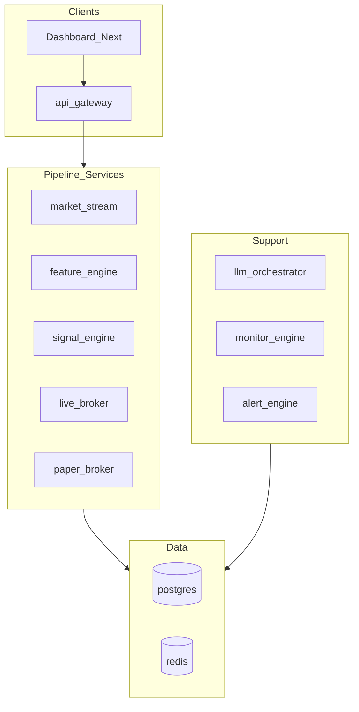

# Codebase-Analyse: Bewertung 1–10 nach Bereichen

**Stand:** 2026-04-24 (P83: P0 geschlossen; Tabelle an Gap-Matrix/Scorecard angeglichen)  
**Abgleich:** Kanonische Zahlen in [FINAL_SCORECARD.md](FINAL_SCORECARD.md), Lücken in [REPO_FREEZE_GAP_MATRIX.md](REPO_FREEZE_GAP_MATRIX.md), Restrisiken in [ROADMAP_10_10_CLOSEOUT.md](ROADMAP_10_10_CLOSEOUT.md) und [adr/ADR-0010-roadmap-accepted-residual-risks.md](adr/ADR-0010-roadmap-accepted-residual-risks.md).

## Methode

- **Primärquelle:** Die Projekt-interne Regel „keine 10 ohne Beleg“ in [FINAL_SCORECARD.md](FINAL_SCORECARD.md) und die Lücken-Tabelle in [REPO_FREEZE_GAP_MATRIX.md](REPO_FREEZE_GAP_MATRIX.md) (P0 per P83 geschlossen; P1/P2 iterativ).
- **Abgrenzung:** Es handelt sich um eine **architektonische und prozessuale** Bewertung (Services, CI, Tests, Doku), nicht um eine statische Code-Metrik (z. B. zyklomatische Komplexität pro Modul). Dafür wären zusätzliche Tool-Läufe nötig.
- **Gesamtnote:** Ein Durchschnitt bleibt irrefuehrend; technische P0-Blocker sind in der Gap-Matrix (P83) **geschlossen** — restliche Streuung = P1/P2 und Betrieb.

## Architekturüberblick (Kontext)

## Bewertungstabelle (Skala 1–10, ganzzahlig)

Die folgenden Werte **entsprechen der kanonischen Scorecard** (Stand 2026-04-24) und werden hier strukturiert und mit Gap-Bezug erläutert.

| Bereich                                    | Score | Kurzbegründung (Repo-Evidenz)                                                                                                                                                                                  |
| ------------------------------------------ | ----- | -------------------------------------------------------------------------------------------------------------------------------------------------------------------------------------------------------------- |
| **Architektur / Modularität**              | **8** | 13 Microservices + Dashboard, Compose, Manifest, ADR; Rest: `env_file`/Profil-Drift zwischen Services und Doku ([REPO_FREEZE_GAP_MATRIX.md](REPO_FREEZE_GAP_MATRIX.md) Block Config, Zeile Default env_files). |
| **Marktuniversum / Multi-Asset**           | **9** | Katalog, `MarketInstrumentFactory` / Identitaet; P0 in Gap-Matrix **erledigt** (P83); pro Service oft single-instrument pro Prozess — wohlgeformt, kein stiller Default.                                    |
| **Entscheidungsintelligenz (Signal)**      | **8** | Spezialisten, Router, Adversary, Tests unter `tests/signal_engine/`; kein LLM-only-Trading (Freeze-Regel).                                                                                                     |
| **Risk / Stop / Leverage / Exit**          | **9** | `exit_engine`, Stop-Budget-Tests, Integer-Leverage, Live-7x-Gates; konservatives Erst-Profil dokumentiert.                                                                                                |
| **Live Broker / Exchange-Control-Plane**   | **8** | Reconcile, Safety, Forensik; Integrationstests für HTTP- und DB-Pfade; echte Exchange-Tiefe nur Staging/ENV ([FINAL_SCORECARD.md](FINAL_SCORECARD.md), [recovery_runbook.md](recovery_runbook.md)).            |
| **Security / Auth / manuelle Aktionen**    | **8** | JWT, Internal-Key, Rate-Limits; CI blockiert `pip_audit_supply_chain_gate.py` und `check_production_env_template_security.py`; `SECURITY_ALLOW_*`/Debug bleiben policy-abhängig.                               |
| **Dashboard / Produkt-UX**                 | **8** | Operator-Cockpit, Shared-TS, `check_contracts.py`; vollständige Payload-Schemas für alle Events iterativ (P2).                                                                                                 |
| **Observability / Forensik**               | **8** | Prometheus, Alerts, Grafana-Dashboards, Worker-Heartbeats in Kern-Loops.                                                                                                                                       |
| **Tests / Coverage / Performance / Chaos** | **8** | `check_coverage_gates.py`, große pytest-Suites, `stack_recovery`-Integration; kein vollständiges Exchange-Chaos im Open-Source-CI ([TESTING_AND_EVIDENCE.md](TESTING_AND_EVIDENCE.md)).                        |
| **Deployment / Release-Hygiene**           | **8** | `constraints-runtime.txt`, `release_sanity_checks.py`, Launch-Doku; P1: `.env.production.example`-Drift, pyproject-Ranges vs. constraints (Gap-Matrix P1).                                                     |
| **Kommerzielle Integrität / Pricing**      | **8** | Ledger, Plan-API, dokumentierte Transparenz; kein externes Billing im Repo.                                                                                                                                    |

## Zusätzliche Querschnitte

(nicht separat in der Scorecard, aus Matrix und Ist-Struktur ableitbar)

| Bereich                                | Score   | Kurzbegründung                                                                                                                                                                |
| -------------------------------------- | ------- | ----------------------------------------------------------------------------------------------------------------------------------------------------------------------------- |
| **Dokumentation / Runbooks**           | **7–8** | Über 90 Markdown-Dateien unter `docs/`, Deploy/Launch/Monitoring; Rest: Deduplizierung und Profil-/Compose-Kohärenz (P2).                                                     |
| **Daten / Migrationen / DB-Design**    | **8**   | SQL-Migrationen unter `infra/migrations/postgres/`, `infra/migrate.py`, Integrationspfade mit DB — ohne separates Performance-Audit.                                          |
| **Contracts / API-Konsistenz (FE/BE)** | **7–8** | Katalog, TS, Schema-Enum, OpenAPI-Kern per Gate; vollständige Gateway-Response-Typing-Tiefe offen (P2, [ROADMAP_10_10_CLOSEOUT.md](ROADMAP_10_10_CLOSEOUT.md) Accepted Risk). |
| **Determinismus / Replay**             | **7**   | Envelope + Tests verbessert; institutionelle Vollabdeckung aller Event-Typen iterativ (P1 medium Rest).                                                                       |
| **Developer Experience**               | **7–8** | Compose, Tools, CI klar; lokaler vollständiger Coverage-/Integration-Lauf braucht Postgres/Redis (in [FINAL_SCORECARD.md](FINAL_SCORECARD.md) dokumentiert).                  |

## Kritische Einschränkungen (P83)

1. **P0 laut Gap-Matrix:** im **Software-Repo** geschlossen; **Vorbehalt** = reale Bitget/Staging, nicht fehlendes Muster.
2. **Accepted Risk** ([adr/ADR-0010-roadmap-accepted-residual-risks.md](adr/ADR-0010-roadmap-accepted-residual-risks.md)): u. a. vollumfaengliche Exchange-Soak, Payload-Typing in allen BFF-Varianten.
3. **Betriebsmodus:** Vollautonomer Live ist **Nein** ([FINAL_SCORECARD.md](FINAL_SCORECARD.md) — beabsichtigtes Sicherheitsziel).

## Empfohlene Lesereihenfolge im Repo

1. Gesamtbild: [FINAL_SCORECARD.md](FINAL_SCORECARD.md)
2. Lücken und Prioritäten: [REPO_FREEZE_GAP_MATRIX.md](REPO_FREEZE_GAP_MATRIX.md)
3. Roadmap-Abschluss: [ROADMAP_10_10_CLOSEOUT.md](ROADMAP_10_10_CLOSEOUT.md)
4. Diese Datei: narrative Zusammenfassung der Bereichsnoten
5. Intensiv + strenge Produktionsreife (G0–G5, Ruff-Baseline, Failure-Modi): [CODEBASE_DEEP_EVALUATION.md](CODEBASE_DEEP_EVALUATION.md)

## Optionaler Folgeschritt

Gezielte **Vertiefung einzelner Services** (z. B. nur `live-broker` oder nur `api-gateway`) mit Ruff/Mypy/Coverage pro Modul — erfordert zusätzliche Tool-Läufe und liegt außerhalb dieser dokumentierten Bewertung.
