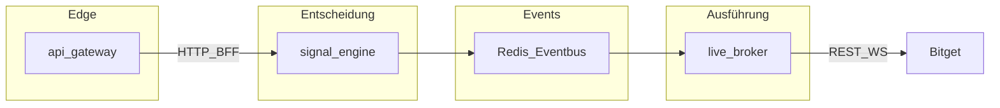

# Codebase — intensive Bewertung und strenge Produktionsreife

**Stand:** 2026-04-02  
**Ergänzt:** [CODEBASE_ANALYSIS_1_10.md](CODEBASE_ANALYSIS_1_10.md), [FINAL_SCORECARD.md](FINAL_SCORECARD.md)  
**Kanonische Lücken:** [REPO_FREEZE_GAP_MATRIX.md](REPO_FREEZE_GAP_MATRIX.md), [ROADMAP_10_10_CLOSEOUT.md](ROADMAP_10_10_CLOSEOUT.md), [adr/ADR-0010-roadmap-accepted-residual-risks.md](adr/ADR-0010-roadmap-accepted-residual-risks.md)

## 1. Methode und Abgrenzung

- **Intensiv:** Hotspots (Orders, Auth, Events, DB, Supply-Chain), Failure-Blast-Radius für Hochrisiko-Services, Test-Marker-Landschaft, **Ist-CI vs. erweiterter Ruff-Scope** auf `services/` + `shared_py`.
- **Streng produktionsreif:** An [LAUNCH_DOSSIER.md](LAUNCH_DOSSIER.md) (G0–G5) und [FINAL_READINESS_REPORT.md](FINAL_READINESS_REPORT.md) ausgerichtet — nicht an Feature-Vollständigkeit.
- **Veto-Regel:** Solange die Gap-Matrix einen **offenen P0** ausweist (Stand Matrix: **BTCUSDT-/Fixture-/Doku-Drift** weiter **major**), ist **„strikt produktionsreif ohne Vorbehalt“ = nein** — unabhängig von hohen Teilscores. Paper-Contract-P0 ist in der Matrix als **erledigt** geführt.

## 2. Strenge Produktionsreife — Rubrik G0–G5

| Gate                        | Anforderung (kurz)                                                                       | Repo-/CI-Evidenz                                                                                                                                                                                                                                 | Status                                                                            |
| --------------------------- | ---------------------------------------------------------------------------------------- | ------------------------------------------------------------------------------------------------------------------------------------------------------------------------------------------------------------------------------------------------ | --------------------------------------------------------------------------------- |
| **G0 — Merge**              | CI grün, Sanity, Lint (Scope), Mypy (kern), Migrate, Pytest+Coverage, Dashboard, Compose | [`.github/workflows/ci.yml`](.github/workflows/ci.yml), `tools/release_sanity_checks.py`, `tools/check_coverage_gates.py`, `tools/check_contracts.py`, `tools/pip_audit_supply_chain_gate.py`, `tools/check_production_env_template_security.py` | **PASS** (Pipeline-Definition; tatsächlicher Lauf = CI-Logs)                      |
| **G1 — Local/Paper**        | Healthcheck, Profil laut Deploy                                                          | `scripts/healthcheck.sh`, [Deploy.md](Deploy.md), [env_profiles.md](env_profiles.md)                                                                                                                                                             | **PARTIAL** (Doku+Skripte da; Nachweis nur mit lokaler ENV)                       |
| **G2 — Shadow Burn-in**     | Prod-ENV ohne Fake, Live-Broker an, Binding/Release-Gates, Health stabil                 | `config/settings.py`, Live-Broker-Gates, [shadow_burn_in_ramp.md](shadow_burn_in_ramp.md)                                                                                                                                                        | **PARTIAL** (Code+Doku; Burn-in-Matrix = Betriebsnachweis)                        |
| **G3 — Live eingeschränkt** | 7x-Deckel, manual mode, Shadow-Match, Keys nur Laufzeit                                  | [live_broker.md](live_broker.md), [LaunchChecklist.md](LaunchChecklist.md)                                                                                                                                                                       | **PARTIAL** (technisch vorgesehen; **kein** Repo-Beweis für eure Bitget-Umgebung) |
| **G4 — Gestufter Ausbau**   | Keine Gate-Regression, Divergenz/Risk verstanden                                         | Tests, Runbooks, [shadow_live_divergence.md](shadow_live_divergence.md)                                                                                                                                                                          | **PARTIAL**                                                                       |
| **G5 — Production voll**    | Obs, On-Call, Backups, Compliance                                                        | [monitoring_runbook.md](monitoring_runbook.md), [prod_runbook.md](prod_runbook.md), [EXTERNAL_GO_LIVE_DEPENDENCIES.md](EXTERNAL_GO_LIVE_DEPENDENCIES.md)                                                                                         | **PARTIAL / extern** (größtenteils außerhalb Repo)                                |

**Urteil (strikt):** **G0** ist im Repo als **Zielbild der Pipeline** abgebildet. **G1–G3** erfordern **umgebungsgebundene** Nachweise. Mit **offenem P0** (Symbol-/Fixture-Drift) ist **„Production ohne Vorbehalt“ = nein**.

## 3. Service-Tiefenmatrix (13 + Dashboard)

| Service                       | Paket-Start                    | Rolle                           | Risiko                               | Tests (Anker)                                                                                                    |
| ----------------------------- | ------------------------------ | ------------------------------- | ------------------------------------ | ---------------------------------------------------------------------------------------------------------------- |
| api-gateway                   | `python -m api_gateway.app`    | Edge HTTP/WS, BFF               | **hoch**                             | `tests/unit/api_gateway/`, Integration HTTP                                                                      |
| live-broker                   | `python -m live_broker.main`   | Echte Orders, Reconcile, Safety | **hoch**                             | `tests/unit/live_broker/`, `tests/integration/test_http_stack_recovery.py`, `test_db_live_recovery_contracts.py` |
| signal-engine                 | `python -m signal_engine.main` | Entscheidung, Risk-Gates        | **hoch**                             | `tests/signal_engine/`                                                                                           |
| market-stream                 | `python -m market_stream.main` | Preis-Feed, Stale/Health        | **mittel–hoch**                      | `tests/market-stream/`                                                                                           |
| paper-broker                  | `python -m paper_broker.main`  | Paper-Ausführung                | **mittel**                           | `tests/paper_broker/`                                                                                            |
| feature / structure / drawing | `*.main`                       | Pipeline-Features               | **mittel**                           | Service-Tests unter `tests/`                                                                                     |
| news / llm                    | `*.main`                       | Ingest, Nebenpfad               | **mittel** (LLM nicht Kern-Executor) | `tests/` je Engine                                                                                               |
| learning / alert / monitor    | `*.main`                       | Drift, Alerts, SLOs             | **mittel**                           | `tests/learning_engine`, `tests/unit/monitor_engine/`                                                            |
| **Dashboard**                 | Node standalone                | Operator-UI                     | **hoch** (Exposition)                | `apps/dashboard/src/lib/__tests__/`                                                                              |

Quellen: [infra/service-manifest.yaml](../infra/service-manifest.yaml), [REPO_FREEZE_GAP_MATRIX.md](REPO_FREEZE_GAP_MATRIX.md) Service-Tabelle.

### 3.1 Failure-Modi und Blast-Radius (Hochrisiko)

**live-broker**

- **Worst-Case:** ungewollter Live-Submit, Reconcile dauerhaft fail ohne Operator-Reaktion, Safety-Latch nicht respektiert.
- **Mitigation (Anker):** `services/live-broker/src/live_broker/execution/service.py` (Gates, `live_allow_order_submit`), Forensik/Reconcile-Tabellen (Migrationen unter `infra/migrations/postgres/`), Runbooks [emergency_runbook.md](emergency_runbook.md), [recovery_runbook.md](recovery_runbook.md).
- **Lücke:** Kein automatisierter **Exchange-Chaos**-Dauerlauf im öffentlichen CI ([TESTING_AND_EVIDENCE.md](TESTING_AND_EVIDENCE.md), ADR-0010).

**api-gateway**

- **Worst-Case:** Auth-Bypass, übermäßige manuelle Mutationsfläche, Rate-Limit-Fehlklassifikation.
- **Mitigation:** `tests/unit/api_gateway/test_gateway_auth.py`, `test_manual_action.py`, `test_gateway_security_hardening.py`, [api_gateway_security.md](api_gateway_security.md).
- **Lücke:** Policy-Flags (`SECURITY_ALLOW_*`) und Debug-Routen sind **umgebungsabhängig** — operative Disziplin nötig.

**signal-engine / market-stream**

- **Worst-Case:** falsche oder veraltete Marktlage → `do_not_trade` verfehlt oder übermäßig; Feed-Stale.
- **Mitigation:** Risk/Stop-Budget-Tests, Feed-Health-Events, Monitor-Alerts; P0-Symbol-Drift kann Entscheidungen verwässern (Gap-Matrix).

## 4. Kritische Daten- und Kontrollflüsse

- **Contracts:** [shared/contracts](shared/contracts), Gate `tools/check_contracts.py`.
- **Persistenz:** `infra/migrate.py`, aktuell **73** SQL-Dateien unter `infra/migrations/postgres/` (Zählung Stand Ausführung).

## 5. Security- und Geheimnisschicht

- **CI (blockierend):** `pip_audit_supply_chain_gate.py`, `check_production_env_template_security.py` ([`.github/workflows/ci.yml`](../.github/workflows/ci.yml)).
- **Laufzeit-Secrets:** `config/required_secrets.py`, Matrix `config/required_secrets_matrix.json` — lokale pytest-Module, die `create_app()` ohne Test-ENV laden, schlagen mit `RequiredSecretsError` fehl (erwartbar; CI setzt Platzhalter).
- **Doku:** [api_gateway_security.md](api_gateway_security.md), Redaction/Forensik in [FINAL_READINESS_REPORT.md](FINAL_READINESS_REPORT.md).

## 6. Test-Landschaft und Marker

| Marker           | Vorkommen (ungefähr, `tests/`)                      | Beispieldateien                                                                                       |
| ---------------- | --------------------------------------------------- | ----------------------------------------------------------------------------------------------------- |
| `integration`    | mehrere Dutzend Markierungen in Integrationsmodulen | `test_http_stack_integration.py`, `test_http_stack_recovery.py`, `test_db_live_recovery_contracts.py` |
| `stack_recovery` | Modul-`pytestmark` u. a.                            | `test_db_live_recovery_contracts.py`, `test_redis_fault_injection.py`                                 |
| `chaos`          | Unit mit strukturierten Inputs                      | `tests/unit/monitor_engine/test_alerts_chaos_pressure.py`                                             |
| `security`       | Gateway                                             | `test_gateway_security_hardening.py`, `test_rate_limit_path_classification.py`                        |

**Lücke:** Soak/Chaos gegen **echte** Bitget-WS nur **Staging** ([TESTING_AND_EVIDENCE.md](TESTING_AND_EVIDENCE.md) Soak-Abschnitt).

### 6.1 Lokaler Pytest-Stichprobe (diese Session)

- Kommando: `python -m pytest tests shared/python/tests -m "not integration" -q`
- Ergebnis auf **Entwickler-Workstation ohne vollständige Secret-ENV:** viele **passed**, aber **Errors** u. a. bei Live-Broker-App-Fixtures wegen `RequiredSecretsError` (fehlende `ADMIN_TOKEN`, `JWT_SECRET`, …). **Referenz für „grün“:** CI-Job mit gesetzter `DATABASE_URL`/`REDIS_URL` und validierten Platzhaltern wie in [`.github/workflows/ci.yml`](../.github/workflows/ci.yml).

## 7. Statische Qualität — CI vs. erweiterter Scope

### 7.1 Was CI wirklich prüft

Aus [`.github/workflows/ci.yml`](../.github/workflows/ci.yml):

- **Ruff:** u. a. `tests/unit`, `tests/integration`, `tests/signal_engine`, `tests/shared`, `tests/paper_broker`, `tools/*.py`, Teile von `config/` — **nicht** der gesamte Quellbaum `services/*/src/**`.
- **Mypy (working-directory `shared/python`):** nur `leverage_allocator.py`, `risk_engine.py`, `exit_engine.py`, `shadow_live_divergence.py` — **kein** repo-weites strict typing der Services.
- **Black:** bewusst **ohne** `tests/unit` (Kommentar „Legacy-Format“).

### 7.2 Erweiterter Ruff-Lauf (Baseline-Technikschuld)

- Kommando: `python -m ruff check services shared/python/src --statistics`
- Ergebnis **2026-04-02:** Gesamt **2911** Befunde (Summe der Regelzähler), dominant **E501** (line-too-long) **2535**; weitere u. a. I001, UP037, B008, F401, F821.
- **Interpretation:** Service-`src/` ist **nicht** CI-Ruff-gesäubert; das ist **kein** Sofort-Release-Blocker, solange CI-Scope grün bleibt, aber **senkt** die Bewertung „Lint-Konsistenz“ im strengen Sinne.

## 8. Frontend (Dashboard)

- CI-Job `dashboard`: pnpm, Tests mit Coverage ([`.github/workflows/ci.yml`](../.github/workflows/ci.yml)).
- Typ-/Contract-Seite: Shared-TS + `check_contracts.py`; vollständige OpenAPI-Response-Typing-Lücke bleibt P2 / Accepted Risk ([ROADMAP_10_10_CLOSEOUT.md](ROADMAP_10_10_CLOSEOUT.md)).

## 9. Bewertung — strenge Tiefendimensionen (1–10)

Kalibrierung: **niedriger**, wo CI absichtlich schmal ist oder P0 offen ist.

| Dimension                                    | Score | Begründung                                                                                                       |
| -------------------------------------------- | ----- | ---------------------------------------------------------------------------------------------------------------- |
| Service-Isolation / Compose-Kohärenz         | **7** | Manifest + Compose abgestimmt; ENV-Profil-Drift bleibt (Gap-Matrix, Default `env_files` vs. `COMPOSE_ENV_FILE`). |
| Typsicherheit (Ist vs. Ideal)                | **6** | Mypy nur auf wenige `shared_py`-Module; Services ohne strict CI-Mypy.                                            |
| Lint-Konsistenz (Ist vs. Ideal)              | **5** | CI-Ruff ohne vollständigen `services/*/src`; erweiterter Ruff ~2911 Findings.                                    |
| Testtiefe kritischer Pfade                   | **8** | Viele Unit-Tests + Integration Recovery/Reconcile/HTTP-Stack; lokale Läufe ohne Secrets unvollständig.           |
| Operative Nachvollziehbarkeit (Runbooks/Obs) | **8** | Prometheus/Grafana/Heartbeats, Runbooks; Soak/Chaos = Staging.                                                   |
| Security-Gates (Supply-Chain + Templates)    | **8** | pip-audit + Prod-ENV-Template-Gate in CI; Rest policy-/ENV-abhängig.                                             |
| Daten-/Migrationsdisziplin                   | **8** | 73 Migrationen, `migrate.py` in CI; Performance-Audit nicht Teil dieses Dokuments.                               |
| Symbol-/Multi-Asset-Kohärenz                 | **4** | **P0 major** (BTCUSDT-Reste) in Gap-Matrix — zieht Produktions-Urteil runter.                                    |

### Binäres Gesamturteil

| Frage                                                   | Antwort                                                                                                                            |
| ------------------------------------------------------- | ---------------------------------------------------------------------------------------------------------------------------------- |
| **Repo merge-fähig laut definierter CI-Pipeline?**      | Ja, wenn CI auf `main` grün ist (**G0**).                                                                                          |
| **Strikt „Production ohne Vorbehalt“ laut Gap-Matrix?** | **Nein** — offener **P0** Symbol-/Fixture-Drift.                                                                                   |
| **Operator-gated Live technisch vorbereitet?**          | **Ja, mit Vorbehalt** — siehe [FINAL_READINESS_REPORT.md](FINAL_READINESS_REPORT.md) und [FINAL_SCORECARD.md](FINAL_SCORECARD.md). |

## 10. Empfohlene nächsten Schritte (für echte Aufwertung)

1. P0 Symbol-/Fixture-/Doku-Drift systematisch abbauen ([REPO_TRUTH_MATRIX.md](REPO_TRUTH_MATRIX.md), Gap-Matrix).
2. Optional: Ruff-Scope schrittweise auf `services/*/src` ausweiten oder Top-Offenders pro Service budgetieren.
3. Staging-Soak und Notfallübungen laut [TESTING_AND_EVIDENCE.md](TESTING_AND_EVIDENCE.md) dokumentieren (Tickets/Evidenz).
