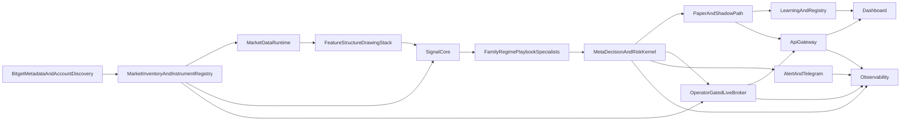

# ADR-0001: Metadata-getriebene Bitget-Plattform

## Status

Accepted as target architecture for the existing monorepo.

## Kontext

Das Monorepo ist historisch aus einer `BTCUSDT`-/`USDT-FUTURES`-zentrierten Spezialloesung gewachsen. Der aktuelle Code enthaelt bereits belastbare Kerne fuer:

- deterministische Risk-/No-Trade-Logik
- Paper / Shadow / operator-gated Live-Ausfuehrung
- einen family-aware Instrumentvertrag in `shared_py.bitget`
- Spezialisten-/Router-Spuren im Signal-Kern

Gleichzeitig ist der Repo-Zustand laut `docs/REPO_TRUTH_MATRIX.md` und `docs/REPO_FREEZE_GAP_MATRIX.md` weiterhin zu stark von:

- Default-Symbolen wie `BTCUSDT`
- Futures-spezifischen Annahmen wie `USDT-FUTURES`
- impliziten Instrumentidentitaeten in Events, Registry und Dashboard

abhaengig.

Das Ziel ist deshalb **kein Greenfield-Rewrite**, sondern eine Umstellung des bestehenden Monorepos auf eine allgemeinere, metadata-getriebene Bitget-Plattform fuer alle Marktfamilien, die durch das aktuelle Konto und die reale Bitget-API-Metadatenlage sauber exponiert sind.

## Entscheidung

Das Monorepo folgt kuenftig einem **metadata-getriebenen Plattformmodell** statt einer instrumentenzentrierten Speziallogik.

### 1. Kanonisches Instrumentmodell

Jede fachliche Entscheidung, jedes Event und jede Ausfuehrung bezieht sich auf ein **kanonisches Instrument** mit mindestens:

- `venue`
- `market_family`
- `symbol`
- `product_type`
- `margin_account_mode`
- `base_coin`
- `quote_coin`
- `settle_coin`
- `metadata_source`
- `metadata_verified`
- Faehigkeitsflags wie `supports_funding`, `supports_open_interest`, `supports_long_short`, `supports_reduce_only`, `supports_leverage`

Das Instrumentmodell ist **die Quelle der Wahrheit**, nicht das einzelne Symbol allein.

### 2. Marktfamilien

Die Plattform unterscheidet mindestens:

- `spot`
- `margin`
  - `isolated`
  - `crossed`
- `futures`
  - `USDT-FUTURES`
  - `USDC-FUTURES`
  - `COIN-FUTURES`

Weitere Bitget-Kategorien wie index-, mark-, CFD- oder stock-linked Chart-Familien werden **nicht vorausgesetzt**. Sie duerfen nur dann in das Inventar aufgenommen werden, wenn sie durch aktuelle Bitget-Metadata-/Market-Endpunkte real erkennbar sind.

Wenn eine Kategorie zwar als Chart-/Marktansicht, aber nicht als tradebare Family exponiert wird, wird sie als:

- inventory-visible
- analytics-eligible
- execution-disabled

gefuehrt. Die Plattform unterscheidet also zwischen **sichtbar**, **analysierbar** und **handelbar**.

### 3. Kein LLM-only-Trading

LLMs bleiben ausschliesslich:

- strukturierte Analysekomponenten
- Erklaer-/Review-Komponenten
- optionale News-/Operator-Hilfsdienste

Der Produktionskern fuer Handelsentscheidungen bleibt:

- deterministische Safety Gates
- Risk Engine
- Family-/Regime-/Playbook-Spezialisten
- Router/Arbitrator
- harte No-Trade-Logik

### 4. Chat ist kein Strategiekonfigurationskanal

Telegram und andere Chat-Kanaele bleiben ausserhalb des Strategie- und Policy-Setups. Chat darf:

- lesen
- erklaeren
- bestaetigen
- oeffnen
- schliessen
- abbrechen
- Notfall-Aktionen ausloesen

aber **nicht**:

- Modellgewichte aendern
- Routing-Policies veraendern
- Playbooks umschreiben
- Risk-Limits setzen
- Registry-Zuordnungen veraendern

### 5. Live bleibt operator-gated

Die Plattform darf autonom:

- analysieren
- shadowen
- paper-traden
- lernen
- Telegram-Updates publizieren

Echte Orders duerfen aber nur ueber:

- explizite operator-gated Freigaben
- autorisierte Open-/Close-/Emergency-Kommandos
- bestehende, auditierbare Live-Gates

laufen.

## Zielbild

## Service-Grenzen im bestehenden Monorepo

Es werden **keine neuen Pflichtruntimes als Greenfield-Stack** eingefuehrt. Die vorhandenen Services bekommen folgende fachliche Zielgrenzen:

| Logische Grenze           | Bestehender Service / Modul                                                                             | Zielverantwortung                                                                                                        |
| ------------------------- | ------------------------------------------------------------------------------------------------------- | ------------------------------------------------------------------------------------------------------------------------ |
| Marktinventar             | `shared_py.bitget.discovery`, `shared_py.bitget.instruments`, spaeter via bestehende Services exponiert | Ermittlung und Versionierung der real sichtbaren Marktfamilien, Instrumente und Capabilities                             |
| Marktdaten                | `services/market-stream`                                                                                | Public-/marktnahe Daten je Instrument/Family; kein Policy- oder Orderwissen                                              |
| Features                  | `services/feature-engine`                                                                               | family-neutrale Ableitung aus Marktdaten; family-spezifische Inputs nur ueber klaren Adapter                             |
| Struktur / Drawings       | `services/structure-engine`, `services/drawing-engine`                                                  | family-neutrale Marktstruktur und Zonenlogik; keine Broker- oder Chat-Logik                                              |
| Spezialisten              | `services/signal-engine`                                                                                | Family-, Regime- und Playbook-Spezialisten plus Router/Arbitrator                                                        |
| Meta-Entscheidung         | `services/signal-engine` + `shared_py.risk_engine` + `shared_py.exit_engine`                            | deterministischer Entscheidungsabschluss, No-Trade, Leverage-/Exit-Gates                                                 |
| Paper / Shadow            | `services/paper-broker`                                                                                 | produktionsnahe, aber nicht live-ausfuehrende Referenzpfade; keine unkontrollierte Fixture-Abkuerzung im Produktionsziel |
| Broker / Live-Ausfuehrung | `services/live-broker`                                                                                  | family-spezifische Execution-Adapter, Order-Lifecycle, Reconcile, Safety, Operator-Gating                                |
| Telegram                  | `services/alert-engine`                                                                                 | Notification, Explain, bestaetigte Operator-Kommandos, niemals Strategie-Mutation                                        |
| Gateway                   | `services/api-gateway`                                                                                  | einzige externe Kontrollgrenze fuer sensible Operator-Pfade; Auth, Audit, Rate-Limits                                    |
| Dashboard                 | `apps/dashboard`                                                                                        | Operator-Sicht auf Inventar, Signale, Broker, Risk, Drift und Freigaben; keine Secrets im Browser                        |
| Learning                  | `services/learning-engine`                                                                              | Registry, Drift, Backtests, Challenger/Champion, Feedback; keine direkte Live-Order-Hoheit                               |
| Observability             | `services/monitor-engine`, `infra/observability`                                                        | serviceuebergreifende Metriken, Alerts, Auditierbarkeit, Drift- und Betriebszustand                                      |

## Generische Module vs. Family-Specific-Adapter

### Generisch zu halten

Diese Bausteine muessen market-family-agnostisch bleiben:

- Event-Huelle und Event-Katalog
- Instrumentidentitaet und Capability-Flags
- Feature-Snapshots und Data-Quality-Gates
- Regime-Klassifikation
- Playbook-Auswahl
- No-Trade-Entscheidung
- Risk-/Drawdown-/Exposure-Gates
- Exit-Intent, Exit-Plan-Validierung und Audit-Trail
- Registry-, Drift- und Promotion-Governance
- Gateway-Audit und Operator-Gating

### Family-Specific-Adapter

Diese Bausteine duerfen und muessen family-spezifisch sein:

- Bitget-Metadata-Parser pro Family
- Public REST-/WS-Endpunkte pro Family
- Private Order- und Account-Endpunkte pro Family
- Order-Body-Builder pro Family
- Margin-/Loan-Semantik fuer `margin`
- Funding/Open-Interest-Adapter fuer `futures`
- Spot-spezifische Restriktionen wie kein natives Shorting
- Family-spezifische Ausfuehrbarkeitsregeln fuer Stops, Ticks, Spread, Reduce-Only, Liquidationsnaehe

## Integration weiterer Familien / Kategorien

Neue Kategorien werden nur ueber einen standardisierten Erweiterungspfad aufgenommen:

1. Discovery findet die Kategorie real ueber API-/Metadata-Endpunkte.
2. Ein neues Endpoint-Profil beschreibt oeffentliche und ggf. private Pfade.
3. Ein Metadata-Parser fuellt das kanonische Instrumentmodell.
4. Capability-Flags markieren, ob die Kategorie:
   - nur sichtbar,
   - nur analysetauglich,
   - paper-/shadow-faehig,
   - live-handelbar
     ist.
5. Ohne execution-faehigen Adapter bleibt die Kategorie **execution-disabled**.

Damit wird Wildwuchs verhindert: eine neue Family darf den generischen Kern **nicht** kopieren, sondern nur ueber klar begrenzte Adapter anbinden.

## Stop-/Exit-Architektur

Die Exit-Architektur bleibt generisch, aber family-aware validiert.

- Die leverage-indexierte Stop-Budget-Kurve ist global.
- Die Ausfuehrbarkeitspruefung ist family-spezifisch.
- Wenn Instrumentmechanik und Stop-Budget kollidieren, gewinnt nie Marketing, sondern:
  - Hebel runter
  - oder `do_not_trade`

Adaptive Exits bleiben Pflicht:

- scale-out
- runner
- break-even
- time-stop
- liquidity target
- event exit
- trend hold
- mean-reversion unwind

## Konsequenzen fuer das bestehende Repo

### Positiv

- Der bestehende Monorepo-Kern bleibt erhalten.
- Die bereits eingefuehrten family-aware Bitget-Module, Spezialisten-Traces und Stop-Budget-Gates sind kompatibel mit diesem ADR.
- Neue Familien koennen spaeter ohne neue Parallelarchitekturen integriert werden.

### Negativ / bewusst offen

- Das Repo ist noch nicht institutionell freigegeben; laut Freeze bleiben mehrere major Gaps offen.
- Nicht jede aktuelle Default-Annahme ist bereits auf das Zielbild gezogen.
- Das ADR erlaubt keine implizite Aufnahme exotischer Bitget-Kategorien ohne echte Discovery-Evidenz.

## Abnahmekriterien fuer diesen Architektur-Schritt

- Es existiert ein kanonisches ADR fuer die Zielarchitektur im Repo.
- Das ADR bindet sich explizit an die vorhandenen Services statt einen Greenfield-Neustart zu beschreiben.
- Marktfamilien, Service-Grenzen, generische Module und Family-Adapter sind klar getrennt.
- LLM-only-Trading und Chat-basierte Strategie-Manipulation sind architektonisch ausgeschlossen.
- Die Architektur bleibt fuer spaetere Familien erweiterbar, ohne Wildwuchs zu erzeugen.

## Referenzen

- `docs/REPO_TRUTH_MATRIX.md`
- `docs/REPO_FREEZE_GAP_MATRIX.md`
- `docs/model_stack_v2.md`
- `docs/bitget-config.md`
- `docs/live_broker.md`
- `infra/service-manifest.yaml`
