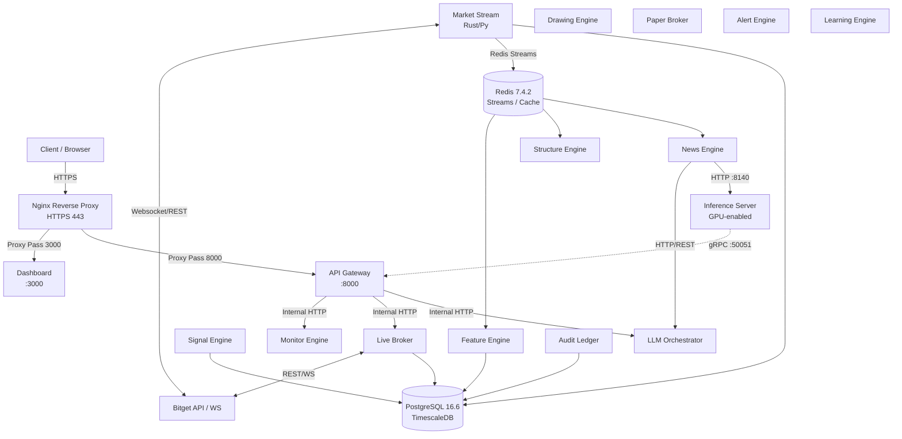

# System Design & Architektur

Dieses Dokument beschreibt die aktuelle Systemarchitektur des `BitgetKiTrading`-Projekts, abgeleitet aus der aktiven Codebasis und den Docker-Compose-Definitionen.

## 1. Systemübersicht & Topologie

Das System ist als modularer Microservice-Stack aufgebaut, orchestriert via Docker Compose, mit strikter Trennung von Datastore, Engines und API-Zugängen.

### Architektur-Diagramm

### Service Registry (Docker Compose)

| Service | Base Image / Dockerfile | Host-Port (Published) | Abhängigkeiten (`depends_on`) |
| :--- | :--- | :--- | :--- |
| **postgres** | `postgres:16.6-alpine` | `5432` (Lokal-Profil) | - |
| **redis** | `redis:7.4.2-alpine` | `6379` (Lokal-Profil) | - |
| **migrate** | `infra/docker/Dockerfile.migrate` | - | `postgres` |
| **api-gateway** | `services/api-gateway/Dockerfile`| `8000` | Alle Engines, `postgres`, `redis`, `migrate` |
| **dashboard** | `apps/dashboard/Dockerfile` | `3000` | `api-gateway` |
| **market-stream** | `services/market-stream/Dockerfile` | - | `postgres`, `redis`, `migrate` |
| **feature-engine** | `services/feature-engine/Dockerfile` | - | `postgres`, `redis`, `market-stream` |
| **structure-engine**| `services/structure-engine/Dockerfile` | - | `postgres`, `redis`, `market-stream` |
| **drawing-engine** | `services/drawing-engine/Dockerfile` | - | `postgres`, `redis`, `structure-engine` |
| **signal-engine** | `services/signal-engine/Dockerfile` | - | `feature-`, `structure-`, `drawing-`, `news-engine` |
| **news-engine** | `services/news-engine/Dockerfile` | - | `postgres`, `redis`, `llm-orchestrator`, `inference-server` |
| **llm-orchestrator**| `services/llm-orchestrator/Dockerfile`| - | `postgres`, `redis`, `audit-ledger` |
| **inference-server**| `services/inference-server/Dockerfile`| - | `redis`, `migrate` (gGPUs optional via compose-merge) |
| **audit-ledger** | `services/audit-ledger/Dockerfile` | - | `postgres`, `migrate` |
| **paper-broker** | `services/paper-broker/Dockerfile` | - | `postgres`, `redis`, `signal-engine`, `news-engine` |
| **live-broker** | `services/live-broker/Dockerfile` | - | `postgres`, `redis`, `paper-broker`, `signal-engine` |
| **alert-engine** | `services/alert-engine/Dockerfile` | - | `postgres`, `redis`, `signal-`, `news-`, `paper-broker` |
| **monitor-engine** | `services/monitor-engine/Dockerfile` | - | `postgres`, `redis`, `api-gateway`, alle Engines |
| **learning-engine** | `services/learning-engine/Dockerfile` | - | `postgres`, `redis`, `paper-broker`, Signale etc. |
| **onchain-sniffer** | `services/onchain-sniffer/Dockerfile` | - | `redis` |
| **prometheus** | `prom/prometheus:v2.54.1` | `9090` | Alle Engines, Broker und Gateways |
| **grafana** | `grafana/grafana:11.2.0` | `3001` | - |

> *Hinweis:* GPU-Support für den `inference-server` wird durch Mergen der Datei `docker-compose.inference-gpu.yml` aktiviert.

---

## 2. Netzwerk- & Routing-Architektur

### Reverse Proxy (Edge)
Die externe Anbindung erfolgt über einen Nginx Reverse Proxy (`infra/reverse-proxy/nginx.single-host.conf`). 
- Der Traffic wird unter Zwang via 301-Redirect von HTTP (Port 80) auf HTTPS (Port 443) umgeleitet.
- **API-Traffic** (z.B. `api.example.com`) wird an `http://127.0.0.1:8000` (API Gateway) weitergeleitet (`proxy_pass`).
- **Dashboard-Traffic** (z.B. `dashboard.example.com`) wird an `http://127.0.0.1:3000` geleitet.
- Es werden strikte Header gesetzt: `X-Content-Type-Options: nosniff` und `X-Frame-Options: DENY`/`SAMEORIGIN`.

### Internal Service Discovery
Innerhalb des Compose-Netzwerks (`bitget_ai_net`) kommunizieren die Container primär über ihre Host-Namen.
Die Datei `config/internal_service_discovery.py` abstrahiert die Ableitung von Basis-URLs (z.B. HTTP-Basis `http://llm-orchestrator:8070` wird aus der Readiness-URL abgeleitet).
Spezifische interne API-Routen sind durch den Header `X-Internal-Service-Key` (bzw. `INTERNAL_API_KEY`) gesichert.
- **REST/HTTP**: Standardprotokoll zwischen den internen Microservices.
- **gRPC**: Der `inference-server` bietet einen dedizierten gRPC-Port auf `50051` (konfiguriert via `INFERENCE_GRPC_PORT`) für hochperformante Modell-Abfragen (TimesFM).

---

## 3. Daten-Tier & Datenbank-Topologie

Die Datenspeicherung trennt sich in schnellen In-Memory Queueing (Redis) und persistente Speicherung (PostgreSQL mit TimescaleDB-Ausrichtung).

### PostgreSQL / Schema Migrationen
Migrationen werden deterministisch beim Systemstart durch den Container `migrate` (basierend auf `infra/migrate.py`) ausgeführt. Das Schema ist über `config/schema_master.hash` eingefroren. 

Wichtige Tabellen und Domänen (sichtbar in `infra/migrations/postgres/*.sql`):
1. **Market Data & TSDB**: `010_tsdb_market_core.sql`, `040_features.sql`, `050_structure.sql` für Candlesticks, Tick-Aggregationen und Orderbook-Snapshots.
2. **Signals & KI-Metadaten**: `070_signals_v1.sql`, `080_signal_explanations.sql`, `090_news_items.sql`, `100_news_scoring.sql`.
3. **Execution & Broker**: `110_paper_broker_core.sql`, `250_live_broker.sql`, `270_live_broker_safety_controls.sql`. Diese Tabellen speichern Orders, Exits, Positions-Reconciliation und Fills.
4. **Billing & Customer**: `598_customer_portal_domain.sql`, `600_billing_daily_prepaid.sql`, `611_profit_fee_hwm.sql` regeln Tenant-Trennung, High-Water-Marks und Ledger.

---

## 4. Core-Observability (Basis)

Das System verfügt über ein umfassendes Monitoring-Setup auf Basis von Prometheus und Grafana (`infra/observability/prometheus.yml` & `prometheus-alerts.yml`).

### Scraping
Prometheus scrapt im 15-Sekunden-Intervall den `/metrics`-Endpoint sämtlicher Services (`api-gateway`, `market-stream`, `live-broker`, etc.).

### Alerting & Alertmanager Rules
In `prometheus-alerts.yml` sind hochkritische P0/P1-Alarmierungsregeln definiert:
- **P0 - GatewayHighErrorRate**: Wenn die Fehlerrate (`status_class="5xx"`) im `api_gateway` über 5% steigt (bezogen auf ein 2m-Fenster).
- **P0 - LiveBrokerDown**: Wenn der Scrape-Job `live-broker` fehlschlägt (`up == 0` für 3 Minuten).
- **P0 - MarketPipelineLag**: Wenn `data_freshness_seconds` für 1m-Kerzen > 5 Sekunden überschreitet.
- **P1 - InferenceGpuSaturation**: Löst aus, falls `gpu_utilization_percent{gpu_index="0"} > 90` oder weniger als 512MB VRAM verfügbar sind.
- **Safety & Trading**: Heartbeats (`LiveBrokerProcessHeartbeatStale`), Reconcile-Lags (`live_reconcile_age_ms > 90000`), sowie Safety-Latch- und Kill-Switch-Aktivierungen (`live_kill_switch_active_count > 0`). 
- Alarme werden oft durch `inhibit_slo`-Labels gedämpft, um Folgealarme bei Root-Causes (wie Datenbank-Ausfall) zu unterdrücken.
