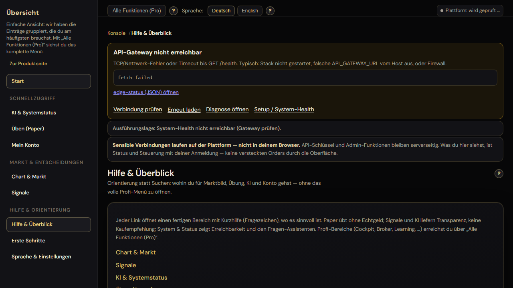
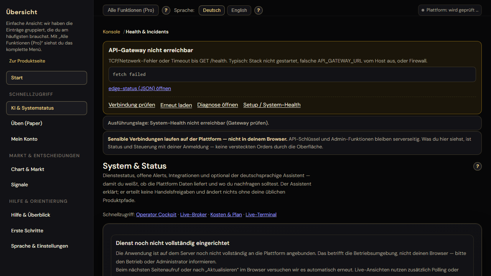
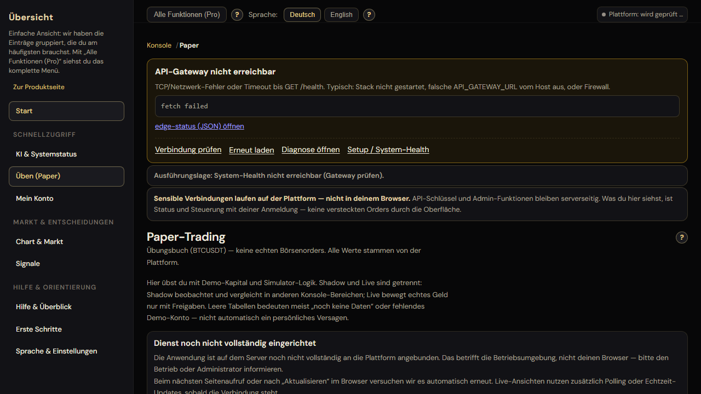
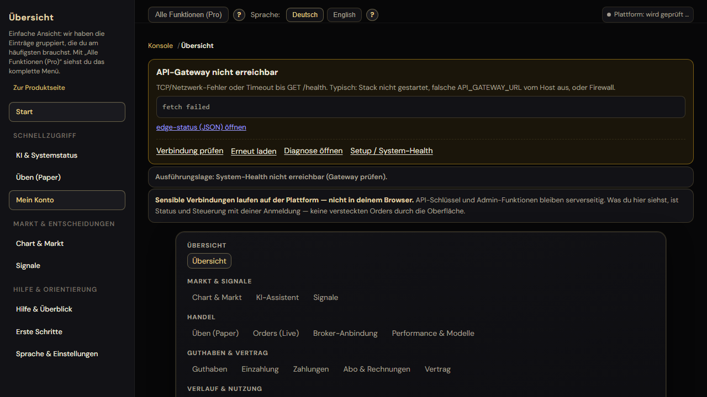
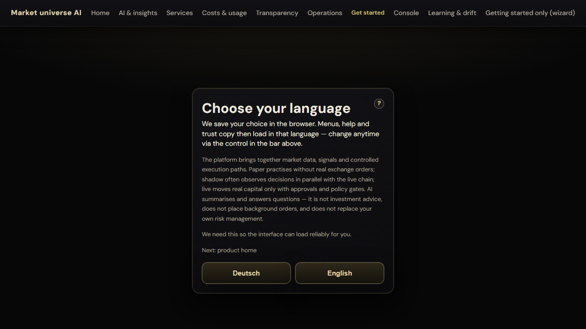
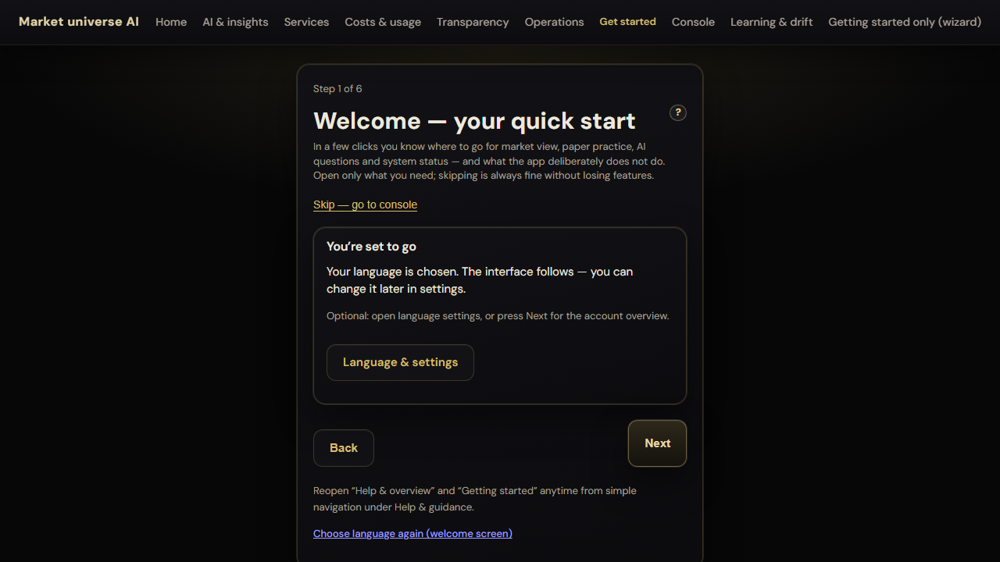
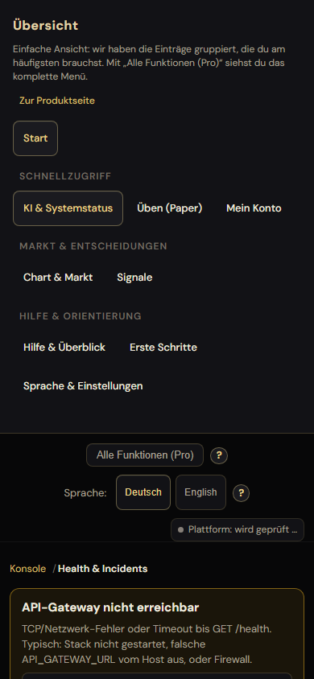
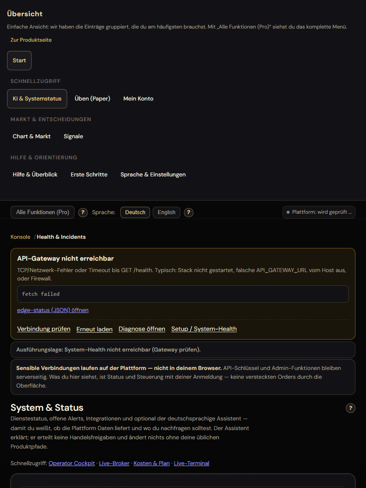

# Finales Release- / Go-No-Go-Dossier (Lauf 50)

**Erstellt:** 2026-04-06 (Ausführung in Workspace `bitget-btc-ai`, Windows).  
**Ziel:** Nachweisbare Gates (Kommandos, Exit-Codes, Log-Pfade, Screenshots), keine Schönwetter-Aussagen.

---

## Gesamturteil

| Domäne | Urteil |
|--------|--------|
| **Statische / CI-nahe Gates** (Typecheck, Format, Pytest `not integration`, Dashboard-Jest, `production_selfcheck`, `.env.local`-Validierung) | **Go** (Exit 0, siehe unten) |
| **Laufzeit-Stack** (Docker Compose, API-Gateway erreichbar, `pnpm smoke`, `api_integration_smoke` Gateway-Schritte, `pnpm stack:check` Gateway) | **No-Go** (Docker Desktop / Pipe nicht verfügbar bzw. Gateway :8000 nicht erreichbar) |
| **Playwright Gesamtlauf `pnpm e2e`** | **No-Go** (1 Test rot: BFF `operator-explain`, siehe unten) |

### Klare Aussage

**Gesamt-Release / Produktions-Go: No-Go.**

Begründung in einem Satz: Ohne erreichbaren API-Gateway-Stack und ohne grünen vollständigen E2E-Lauf (inkl. BFF-KI-Pfad mit gültigem `DASHBOARD_GATEWAY_AUTHORIZATION` im **laufenden** Dashboard-Prozess) ist das Runtime-Release nicht belegt; die Code- und Test-Artefakt-Pipeline ist hingegen in diesem Lauf grün.

---

## Ausgeführte Kommandos (Chronologie, relevant)

| # | Kommando | Exit | Roh-Log / Exitcode-Datei |
|---|----------|------|---------------------------|
| 1 | `pnpm check-types` | 0 | `docs/cursor_execution/50_release_evidence/40_check_types.log`, `.exitcode` |
| 2 | `pnpm format:check` (nach Fixes) | 0 | `docs/cursor_execution/50_release_evidence/53_format_check_final.log`, `53_format_check_final.exitcode` |
| 3 | `python tools/production_selfcheck.py` | 0 | `docs/cursor_execution/50_release_evidence/45_production_selfcheck.log`, `.exitcode` |
| 4 | `python tools/validate_env_profile.py --env-file .env.local --profile local --with-dashboard-operator` | 0 | `docs/cursor_execution/50_release_evidence/46_validate_env.log`, `.exitcode` |
| 5 | `pnpm stack:check` | 1 | `docs/cursor_execution/50_release_evidence/33_stack_check.log`, `.exitcode` |
| 6 | `pnpm smoke` (= `rc_health.ps1`) | 1 | `docs/cursor_execution/50_release_evidence/49_pnpm_smoke.log`, `.exitcode` |
| 7 | `python scripts/api_integration_smoke.py` | 1 | `docs/cursor_execution/50_release_evidence/50_api_integration_smoke.log`, `.exitcode` |
| 8 | `python -m pytest tests shared/python/tests -m "not integration" -q --tb=no` | 0 | `docs/cursor_execution/50_release_evidence/44_pytest_not_integration_final.log`, `.exitcode` |
| 9 | `pnpm --filter @bitget-btc-ai/dashboard run test:ci` | 0 | `docs/cursor_execution/50_release_evidence/47_dashboard_jest.log`, `.exitcode` |
| 10 | `pnpm e2e` | 1 | `docs/cursor_execution/50_release_evidence/48_pnpm_e2e.log`, `.exitcode` |
| 11 | `pnpm exec playwright test … trust-surfaces + responsive-shell` | 0 | `docs/cursor_execution/50_release_evidence/52_trust_responsive_screenshots.log`, `.exitcode` |
| 12 | `pnpm bootstrap:local` | 1 | `docs/cursor_execution/50_release_evidence/54_bootstrap_local.log`, `.exitcode` |

Hinweis: Ältere Zwischenläufe (z. B. `34_*`, `39_*`) liegen ebenfalls unter `docs/cursor_execution/50_release_evidence/`.

---

## Rohauszüge (repräsentativ)

### `pnpm check-types` (Exit 0)

```
Tasks:    2 successful, 2 total
```

(Vollständig: `50_release_evidence/40_check_types.log`.)

### `pnpm format:check` (Exit 0, final)

```
Checking formatting...
All matched files use Prettier code style!
```

(`50_release_evidence/53_format_check_final.log`.)

### `python tools/production_selfcheck.py` (Exit 0, Kopf/Fuss)

```
==> modul_mate_selfcheck (Migration 604, shared_py-Import, optional DB)
OK: Migration 604 + migrate.py vorhanden, shared_py importierbar (angewendete/pending Migrationen nur mit DB pruefbar)
SKIP: DATABASE_URL nicht gesetzt - keine DB-Pruefung
…
OK: production_selfcheck abgeschlossen (ruff + black + mypy + pytest + llm_eval + contracts + schema + env-template-security + env.local.example profile)
```

(`50_release_evidence/45_production_selfcheck.log` — PowerShell meldet Unicode-Zeilen von `black` als `NativeCommandError`, Inhalt dennoch OK.)

### ENV-Validierung (Exit 0)

```
OK validate_env_profile: local .env.local
```

(`50_release_evidence/46_validate_env.log`.)

### Pytest `not integration` (Exit 0)

```
1130 passed, 31 deselected in 664.10s (0:11:04)
```

(`50_release_evidence/44_pytest_not_integration_final.log`.)

### Dashboard Jest (Exit 0)

```
Test Suites: 49 passed, 49 total
Tests:       210 passed, 210 total
```

(`50_release_evidence/47_dashboard_jest.log`.)

### `pnpm stack:check` (Exit 1, Gateway)

```
==> API-Gateway /health
    http://127.0.0.1:8000/health
    FEHL: Die Verbindung mit dem Remoteserver kann nicht hergestellt werden.
…
Das Dashboard (Next.js) allein reicht nicht: Monitor, Drift, Live-Daten kommen vom API-Gateway.
```

(`50_release_evidence/33_stack_check.log`.)

### `pnpm smoke` (Exit 1)

```
FAIL http://127.0.0.1:8000/v1/meta/surface -> <urlopen error [WinError 10061] … Verbindung verweigerte>
```

(`50_release_evidence/49_pnpm_smoke.log`.)

### `api_integration_smoke.py` (Exit 1, Gateway)

```
[1] GET /health -> FAIL <urlopen error [WinError 10061] …>
[2] GET /ready -> FAIL …
[3] GET /v1/system/health -> FAIL …
ERGEBNIS: mindestens ein kritischer Schritt fehlgeschlagen.
…
[4] Bitget public tickers -> HTTP 200 api_code=00000
```

(`50_release_evidence/50_api_integration_smoke.log`.)

### `pnpm e2e` (Exit 1)

```
1 failed
  [chromium] › e2e\tests\release-gate.spec.ts:22:7 › … BFF Operator-Explain …
Error: operator-explain HTTP 503 {"detail":"DASHBOARD_GATEWAY_AUTHORIZATION fehlt …","code":"DASHBOARD_GATEWAY_AUTH_MISSING",…}
37 passed (1.6m)
```

(`50_release_evidence/48_pnpm_e2e.log`.)

**Technische Einordnung:** `DASHBOARD_GATEWAY_AUTHORIZATION` muss im **Prozess** des Next-Servers stehen (`.env.local` wird beim Start eingelesen). Nach `mint_dashboard_gateway_jwt.py --update-env-file` ist ein **Neustart** des Dashboards nötig. Ein zweites `next dev` im selben App-Verzeichnis auf anderem Port scheitert an der Next-„single dev server“-Sperre — verwalteter E2E-Server wurde verworfen zugunsten dokumentierter manueller Schritte.

### `pnpm bootstrap:local` (Exit 1, Docker)

Nach Fix eines PowerShell-Parserfehlers (Unicode-Gedankenstrich in `throw`):

```
compose_start_preflight: OK (local) … 17 Service(s) …
==> Stage: datastores
unable to get image 'redis:7.4.2-alpine': failed to connect to the docker API at npipe:////./pipe/dockerDesktopLinuxEngine
docker compose failed: up -d postgres redis
```

(`50_release_evidence/54_bootstrap_local.log`.)

---

## Grüne Punkte (Zusammenfassung)

- `pnpm check-types`
- `pnpm format:check` (inkl. `e2e/.auth/storageState.json`, `e2e/tests/release-gate.spec.ts`)
- `python tools/production_selfcheck.py` (ruff, black, mypy, Kern-pytests, llm_eval, contracts, env-template, validate aus Example)
- `python tools/validate_env_profile.py --env-file .env.local --profile local --with-dashboard-operator`
- `python -m pytest tests shared/python/tests -m "not integration"` → **1130 passed**
- `pnpm --filter @bitget-btc-ai/dashboard run test:ci` → **210 passed**
- Playwright-Teillauf Trust + Responsive Screenshots → **22 passed** (`52_trust_responsive_screenshots.log`)

---

## Rote Punkte / Blocker

| Gate | Blocker |
|------|---------|
| Docker / Bootstrap | `dockerDesktopLinuxEngine` Pipe fehlt — Docker Desktop nicht erreichbar (`54_bootstrap_local.log`). |
| Gateway Health / Smoke / API-Smoke (Schritte 1–3) | `WinError 10061` auf `127.0.0.1:8000` (`49_*`, `50_*`, `33_*`). |
| `pnpm e2e` vollständig | HTTP 503 `DASHBOARD_GATEWAY_AUTH_MISSING` auf `operator-explain` (`48_*`) — JWT nach Mint + Dashboard-Neustart erforderlich. |

---

## Screenshots (kritische Flächen, dieser Lauf)

Erzeugt durch `playwright test` auf `trust-surfaces.spec.ts` und `responsive-shell.spec.ts` (siehe `52_*`).

### Trust / Einstieg (`docs/cursor_execution/49_trust_assets/`)













### Responsive Shell (`docs/cursor_execution/47_responsive_assets/`)

Auszug (alle Dateien `mobile-console_*.png`, `tablet-console_*.png` im Ordner):





---

## Code-/Test-Fixes in diesem Prüfpfad (kurz)

1. **`tests/unit/live_broker/conftest.py`** (neu): Autouse neutralisiert Host-`.env.local`-Lecks (`BITGET_DEMO_*`, `LIVE_BROKER_REQUIRE_COMMERCIAL_GATES`, `MODUL_MATE_GATE_ENFORCEMENT`), die zuvor Massen-Failures in Live-Broker-Unit-Tests verursachten.
2. **`tests/unit/contracts/test_openapi_export_sync.py`:** `prometheus_client`-Module aus `sys.modules` entfernen vor Re-Import des Gateways — behebt `Duplicated timeseries` nach vorherigem `api_gateway`-Import in derselben pytest-Session.
3. **`scripts/bootstrap_stack.ps1`:** Parser-sicherer ASCII-Strich im `throw` (Zeile ~275).
4. **Prettier:** `e2e/.auth/storageState.json`, `e2e/tests/release-gate.spec.ts` (und erneut `storageState.json` nach E2E-Läufen).

---

## Explizite Restrisiken

- **[RISK]** Kein Nachweis eines laufenden vollständigen Compose-Stacks auf dieser Maschine → keine End-to-End-Verifikation gegen echte Gateway-Container.
- **[RISK]** `production_selfcheck` ohne `DATABASE_URL`: DB-Migrations-/Tenant-Gates nur teilweise ausgeführt (`SKIP` im Log).
- **[RISK]** Vollständiger `pnpm e2e` hängt an korrekt gemintetem JWT **und** neu gestartetem Dashboard; allein `.env.local`-Schreiben reicht nicht.
- **[TECHNICAL_DEBT]** Next.js meldet ggf. `envDir`-Hinweis in `next.config` (Warnung im WebServer-Versuch); nicht Gegenstand dieses Dossiers, aber sichtbar in alten Logs.

---

## Wiederholung „grünes“ Runtime-Release (Checkliste)

1. Docker Desktop starten, `pnpm bootstrap:local` bis Ende grün (oder äquivalenter Stack).
2. `pnpm dev:up` / Compose laut Doku; `pnpm stack:check` Exit 0.
3. `python scripts/mint_dashboard_gateway_jwt.py --env-file .env.local --update-env-file` **und** Dashboard neu starten.
4. `pnpm smoke`, `python scripts/api_integration_smoke.py`, `pnpm e2e` — alle Exit 0.

---

## Dateiverweise

- Evidenz-Logs: `docs/cursor_execution/50_release_evidence/*.log` und `*.exitcode`
- Dieses Dossier: `docs/cursor_execution/50_final_release_dossier.md`
