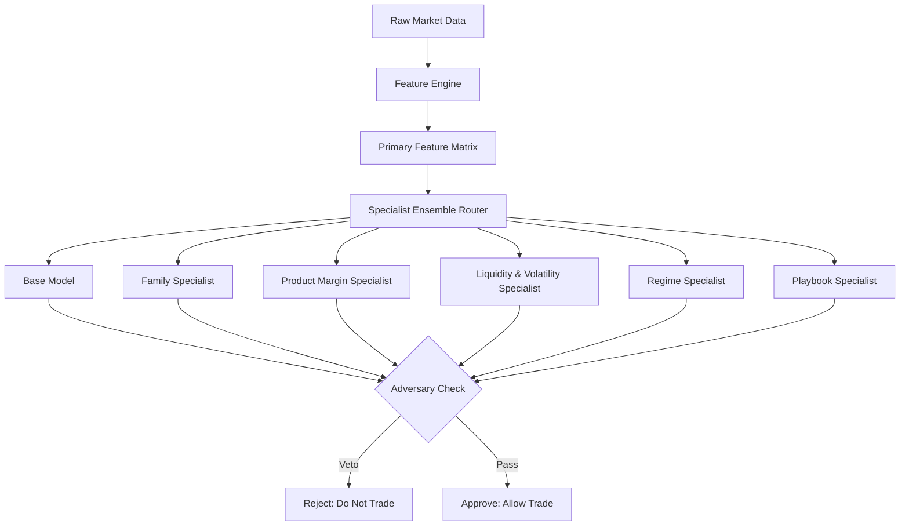

# Signal & Market Engine

Die Market- und Signal-Engine verarbeiten den rohen Orderbook-Datenstrom von Bitget in Echtzeit und destillieren daraus strukturierte Handelsentscheidungen. Sie basieren auf einem deterministischen Spezialisten-Ensemble, das Signale gegen eine statische Registry von Playbooks abgleicht.

## 1. Market Stream & Ingestion

Die Marktdaten werden direkt über die Bitget WebSocket-API konsumiert.

- **WebSocket Client (`client.py`)**: Hält die stehende Verbindung zu Bitget aufrecht. Integriert Ping/Pong-Watchdogs und ein Auto-Reconnect bei Timeout.
- **Sequence Buffer (`sequence_buffer.py`)**: Buffert und sortiert eingehende Nachrichten deterministisch nach der Bitget-Sequenznummer (`instId`). Tritt ein Gap (Fehlende Sequenz) auf, eskaliert das System den Stream (`STREAM_GAP_EVENT`).
- **Gap Fill Worker (`rest_gapfill.py`)**: Falls Sequenzlücken nicht rechtzeitig über den WebSocket geschlossen werden, synchronisiert der Worker per REST-Fallback nach, um korrumpierte Orderbooks zu verhindern.

## 2. Feature Calculation (Numeric Hotpaths)

Die Rohdaten werden in der `feature-engine` in hochdimensionale Features übersetzt.

- Um Performance-Limits von Python zu umgehen, sind rechenintensive Indikatoren (RSI, ATR, Trend) in Rust implementiert (`shared_rs/apex_core/src/lib.rs`). 
- Python (`numeric_hotpath.py`) greift per FFI-Bridge (PyO3) auf die `apex_core` Rust-Routinen zu. 
- Falls die Rust-Core-Module nicht verfügbar sind, existiert ein langsamerer Python-Fallback, der jedoch für Hochfrequenz-Szenarien vermieden wird.

## 3. Signal Engine & Specialist Ensemble

Das Herzstück der Entscheidungsfindung ist das deterministische Spezialisten-System (`signal_engine/specialists.py`). Im Gegensatz zu Black-Box KI-Modellen stützt sich das System auf eine definierte Hierarchie spezialisierter Prüfinstanzen.

| Specialist | Verantwortung |
|---|---|
| **Family / Product Specialist** | Validiert, ob das Signal überhaupt im aktuellen Markt unterstützt wird (z.B. keine Short-Trades in Spot-Märkten ohne Leverage). |
| **Regime Specialist** | Erkennt das aktuelle Marktszenario (z.B. Trend, Range, Shock) und blockt Signale, die gegen das Regime laufen. |
| **Liquidity Specialist** | Überprüft `spread_bps` und Tiefe des Orderbuchs. Sind Märkte zu illiquide (`liquidity_below_hard_floor`), wird das Signal verworfen. |
| **Playbook Specialist** | Mappt das Signal gegen die statische `PLAYBOOK_REGISTRY`. Berechnet einen Kompatibilitätsscore basierend auf Konfluenz, Momentum und Mean-Reversion. Es nutzt ein Anti-Pattern-Scoring (Penalties), um Fehlentscheidungen (z.B. *late trend chase*) hart zu bestrafen. |
| **Adversary Check** | Die finale Instanz (`run_adversary_check`), die nach Veto-Prinzipien sucht. Findet sie ein Veto-Kriterium, kippt das gesamte Signal auf "Do Not Trade". |

Dieses strikte Veto-Konzept stellt sicher, dass das System nur bei extrem hoher Überzeugung ("High Conviction") in den Markt geht.
